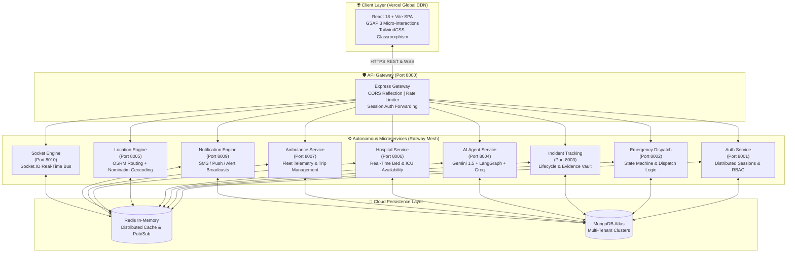

# 🚨 ResQ AI — Autonomous Emergency Response & Intelligent Medical Dispatch Ecosystem

[](https://resq-ai-lilac.vercel.app/)
[](https://resq-ai-production-53df.up.railway.app/)
[](https://github.com/MajidMMF/resq-ai)
[](https://github.com/MajidMMF/resq-ai)

> **Saving the "Golden Hour"**: An end-to-end distributed system that automates trauma triage, dispatches the nearest ambulance via real-time telemetry, and reserves hospital ICU beds before the patient even arrives.

---

## 🌐 Live Deployments & Demo Links

- 🖥️ **Live Web Application (Vercel):** [https://resq-ai-lilac.vercel.app/](https://resq-ai-lilac.vercel.app/)
- ⚡ **API Gateway & Microservices (Railway):** [https://resq-ai-production-53df.up.railway.app/](https://resq-ai-production-53df.up.railway.app/)
- 🔑 **Instant Demo Credentials (Hackathon Evaluators & Judges):**

| Role / Portal | Demo Email | Password | Destination & Capabilities |
| :--- | :--- | :--- | :--- |
| 👤 **Citizen / User Panel** | `abc@gmail.com` | `99999999` | 1-Tap SOS, Multimodal AI Triage, Live Tracking |
| 🚑 **Ambulance Driver Cockpit** | `abc1@gmail.com` | `99999999` | Real-time GPS routing, OTP Patient Verification |
| 🏥 **Hospital Command Center** | `abc2@gmail.com` | `99999999` | Live ICU / Bed Allocator, Pre-Arrival Triage Alerts |

> 💡 *Judges can directly use the credentials above on the [Login Page](https://resq-ai-lilac.vercel.app/login) to evaluate each dashboard instantly.*

---

## 💡 The Problem & The "Golden Hour" Dilemma

In medical trauma cases, the first **60 minutes**—known as the **Golden Hour**—determines life or death:
1. **Chaotic 911/108 Calls**: Call operators spend 4–8 critical minutes asking panicked bystanders for addresses and triage details.
2. **Blind Dispatch**: Ambulances are dispatched without knowledge of real-time road bottlenecks or patient trauma severity.
3. **Hospital Bottlenecks**: Trauma centers are blind to incoming patients until the ambulance physically arrives, wasting 15–20 minutes prepping blood bags, ventilators, and surgeons.

### 🌟 The ResQ AI Solution
ResQ AI completely replaces human friction with an **autonomous agentic pipeline**:
- **1-Tap SOS / Voice / Photo Triage**: Bystanders snap a picture or tap SOS; multimodal AI (Gemini 1.5 + LangGraph) detects injuries, burns, fractures, and blood loss in **< 3 seconds**.
- **Autonomous Dispatch**: Coordinates the nearest available ambulance using live GPS, geospatial indexing, and open-source routing algorithms.
- **Pre-Arrival Hospital Handshake**: Reserves specific ICU beds and notifies the trauma team before the ambulance reaches the hospital gates, verified with cryptographically secure arrival OTPs.

---

## 🏛️ System Architecture

ResQ AI is built as a **decoupled, event-driven 10-Microservice architecture** communicating through a centralized API Gateway, distributed Redis Pub/Sub, and WebSocket telemetry mesh:



---

## 📦 The 10 Microservices Breakdown

| # | Microservice | Port | Primary Responsibilities | Key Technologies |
|---|---|:---:|---|---|
| **1** | **`resq-gateway`** | `8000` | Single entry point, dynamic CORS reflection, session cookie verification, HTTP/WS reverse proxy | Express, Express HTTP Proxy, Morgan |
| **2** | **`resq-auth`** | `8001` | Multi-role RBAC (Citizen, Driver, Hospital, Admin), distributed Redis session storage, Bcrypt | Express, Mongoose, Redis, Zod |
| **3** | **`resq-emergency`** | `8002` | High-speed emergency SOS creation, state machine (Requested → Dispatched → En Route → Admitted) | Express, State Machine, Redis |
| **4** | **`resq-incident`** | `8003` | Incident logging, evidence storage, severity categorization, auditable timelines | Express, Mongoose, File Pipeline |
| **5** | **`resq-agent`** | `8004` | Multimodal AI scene assessment, LangGraph decision graph, conversational first-aid advice | Google Gemini 1.5 Flash, Groq LLaMA 3.1, LangChain |
| **6** | **`resq-location`** | `8005` | 100% Free Open Geospatial stack: reverse geocoding, turn-by-turn routing, nearest ETA calculations | OpenStreetMap Nominatim, OSRM, Overpass API |
| **7** | **`resq-hospital`** | `8006` | Live trauma bed, ICU, and ventilator capacity management, emergency patient pre-registration | Express, Mongoose, Redis Cache |
| **8** | **`resq-ambulance`** | `8007` | Ambulance fleet management, driver geolocation streaming, OTP arrival verification | Express, Mongoose, Socket Client |
| **9** | **`resq-notification`** | `8009` | Multi-channel emergency notifications, room broadcasts, siren alerts | Express, Zod, Socket.IO Client |
| **10** | **`resq-socket`** | `8010` | Horizontal WebSocket hub, room-based broadcast (driver-to-user-to-hospital live tracking) | Socket.IO, Redis Adapter |

---

## 🚀 Key Innovations & Hackathon Differentiators

### 1. 🧠 Agentic Multimodal Triage (LangGraph + Gemini)
- Bystanders can upload a photo of the accident scene or type unstructured symptoms ("Heavy bleeding from head, breathing shallow").
- The **AI Vision & Triage Agent** categorizes injury severity (Critical, Severe, Moderate), identifies trauma indicators, and calculates emergency priority scoring in seconds without human bias.

### 2. 🗺️ Zero-Cost Geospatial Infrastructure (Goodbye Google Maps API Bills!)
- Proprietary emergency systems incur massive Google Maps API bills for continuous GPS streaming.
- ResQ AI implements a **100% Open-Source Geospatial Stack**:
  - **Nominatim** for reverse geocoding
  - **OSRM (Open Source Routing Machine)** for speed-optimized emergency route polylines
  - **Overpass API** for real-time facility mapping

### 3. 🔐 Cryptographic OTP Handshake Protocol
- Prevents false ambulance handoffs and ensures exact patient custody transfer.
- When an ambulance arrives at the scene, a one-time cryptographic code (OTP) generated on the citizen's screen is verified by the driver before transport initiates.

### 4. ⚡ Horizontal WebSocket Hub on Redis Pub/Sub
- Clustered Socket.IO nodes connected through Redis Adapters.
- When an ambulance moves 5 meters, the updated coordinates broadcast to the victim's map, the hospital's command desk, and the central dispatch console simultaneously with **< 50ms latency**.

---

## 🎨 Role-Based Portals & Dashboards

The application provides tailored, real-time command interfaces for all 4 emergency stakeholders:

### 👤 Citizen / Bystander Portal
### 👤 Citizen / Bystander Portal (`abc@gmail.com` / `99999999`)
- **1-Tap Emergency Trigger**: Instant SOS with auto-GPS capture.
- **Live Dispatch Stepper**: Real-time progress tracker (Assigned → Dispatched → Picked Up → Hospital Arrived).
- **Interactive AI Medical Advisor**: Floating conversational assistant providing immediate CPR/first-aid instructions while the ambulance is en route.

### 🚑 Ambulance Driver Cockpit
### 🚑 Ambulance Driver Cockpit (`abc1@gmail.com` / `99999999`)
- **Turn-by-Turn Route Polyline**: Optimized emergency route to the patient and from the patient to the designated trauma hospital.
- **One-Click Handshake**: Arrival OTP verification and patient status updates.

### 🏥 Hospital Trauma Command Center
### 🏥 Hospital Trauma Command Center (`abc2@gmail.com` / `99999999`)
- **Pre-Arrival Notification Board**: Complete trauma breakdown, estimated ETA, and patient medical profile before physical arrival.
- **Real-Time Resource Allocation**: Toggle bed occupancy, ICU beds, and ventilator availability with instant system-wide sync.

### 🛡️ City Emergency Administration
- **Live Fleet Telemetry**: City-wide map of active emergency runs, fleet distribution, and response time analytics.

---

## 🛠️ Complete Tech Stack

```text
Frontend:         React 18, Vite, TailwindCSS, GSAP 3 (Micro-interactions), Lucide Icons, Redux Toolkit
Backend:          Node.js, Express, ES Modules, Concurrently, HTTP Proxy
AI & Agentic:     Google Gemini 1.5 Flash, LangChain, LangGraph, Groq LLaMA-3.1-70B, OpenRouter
Databases:        MongoDB Atlas (Mongoose ODM), Redis (IoRedis, Cache & Pub/Sub)
Real-Time:        Socket.IO with Redis Adapter
Geospatial:       OpenStreetMap, OSRM Project, Nominatim API, Overpass API
DevOps & Cloud:   Docker, Railway (Container PaaS), Vercel (Edge CDN), GitHub CI/CD
```

---

## 💻 Local Development Setup

To run the entire ecosystem locally on your machine:

### 1. Prerequisites
- [Node.js](https://nodejs.org/) (v20 or v22)
- [Docker Desktop](https://www.docker.com/) (for local Redis)

### 2. Clone the Repository
```bash
git clone https://github.com/MajidMMF/resq-ai.git
cd resq-ai
```

### 3. Start All 10 Backend Services & Redis
```bash
cd backend
npm install
npm run dev
```
*(This starts Redis on port 6379, Gateway on port 8000, and all 9 microservices on ports 8001–8010).*

### 4. Start the Frontend
```bash
cd ../frontend
npm install
npm run dev
```
Open `http://localhost:5173` in your browser!

---

## 🏆 Hackathon Presentation Pitch (3-Minute Script)

> **"Judges, every single year, over 1.3 million people die in road accidents worldwide. 50% of those deaths happen during the first 60 minutes—the Golden Hour—due to chaotic triage and uncoordinated emergency services.**
>
> **Meet ResQ AI.**
>
> **Instead of an operator asking 20 questions while a patient bleeds out, a bystander taps SOS or snaps a picture. In under 3 seconds, our multimodal Gemini & LangGraph AI analyzes the trauma, calculates the severity score, and instantly dispatches the nearest ambulance using our zero-cost OpenStreetMap routing engine.**
>
> **Before the ambulance even reaches the hospital, our Redis Pub/Sub mesh alerts the trauma center, reserves an ICU bed, and prepares the surgical bay.**
>
> **10 microservices, sub-second telemetry, autonomous AI triage, and zero human delay. ResQ AI doesn't just manage emergencies—it saves lives."**

---

## 👨‍💻 Author & Credits

- **Developer:** Mohammad Majid ([@MajidMMF](https://github.com/MajidMMF))
- **Showcase:** Built with passion for hackathons and public health innovation.
- **License:** MIT License
